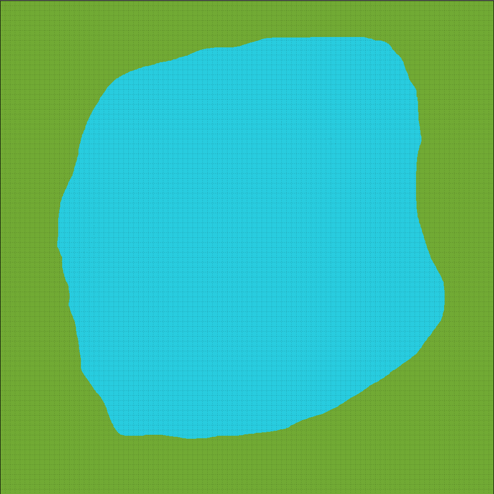
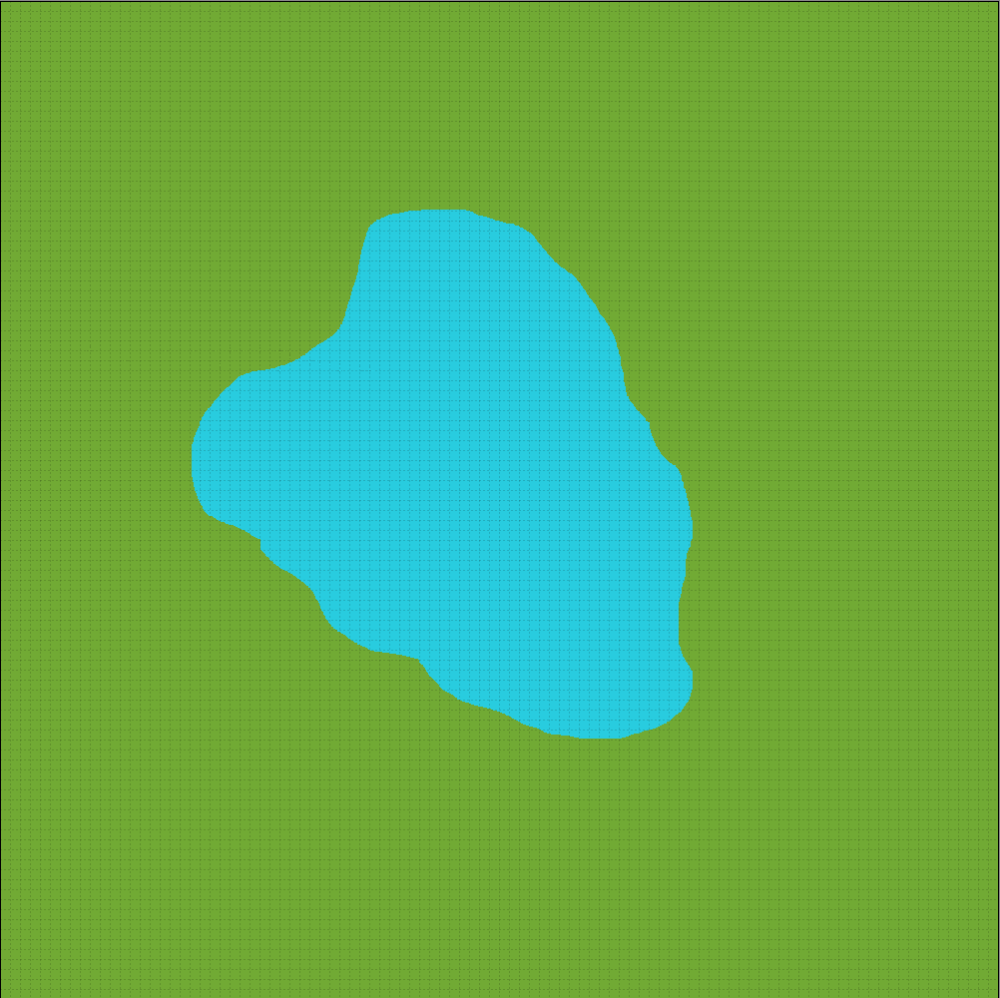

# Convolutional Frontier Detection

## Running the code

Two versions of running/testing the algorithms can be found. The first only runs detection, just to compare the speeds of the algorithms to each other. This can be found in [detection_speed_test.py](./detection_speed_test.py).

The second version of running the algorithms can be found in [map_exploration.py](./map_exploration.py). This one runs a full exploration process, from detection, goal assignment, and path planning/traversal. The code tends to run fairly slow due to the A* algorithm though, which is the reasoning for providing the first version.

For both versions of the file, you can run with just

```sh
$ python detection_speed_test.py
```

or

```sh
$ python map_exploration.py
```

The file [config.yml](./config.yml) contains a few parameters that can be tuned, specifically for the map exploration version, such as the view distance of the robot, along with steps before replanning and such.

## Creating Maps

To create the maps, we utilize the free [Tiled Map Editor](https://www.mapeditor.org/). The software provides an easy way to produce tilemap based worlds, which works very well for the occupancy-grid based exploration. After exporting to JSON format, you will want to take note of which number represents 'wall' and which represents 'open'. Additionally, we specially mark 'explored-wall' and 'explored-open' for the detection speed test. These values should be updated in [config.yml](./config.yml) after taking note. This ensures the occupancy grid loads in the map correctly.

Here is an example of what the editor looks like: 

## Images of the Maps

### Large Field (Large Explored)

This is a 1000x1000 occupancy grid with a large amount of the area being pre-explored. This is a good one for testing the impact that having a large grid, along with a large perimeter of frontiers can do to the timing of various algorithms.



### Large Field (Medium Explored)

This is a 1000x1000 occupancy grid with a medium amount of the area being pre-explored. This is a good one to use alongside the previous, to test the difference the world size makes vs. the perimeter size of the frontiers.



### Medium Field (Large Explored)

This is a 500x500 occupancy grid with the majority of the area being pre-explored. This one tests on a smaller map, but still with most of it being explored.


### Medium Field (Medium Explored)

This is a 500x500 occupancy grid with a medium amount of the area pre-explored. Once again, good for comparing to the other medium sized field.


### Star Field

This is a 1000x1000 occupancy grid, with the exploration in a star pattern. This design was adapted from a paper which described that star shapes are some of the worst case scenarios for detection algorithms, as it is maximizing the possible perimeter around the frontier.

